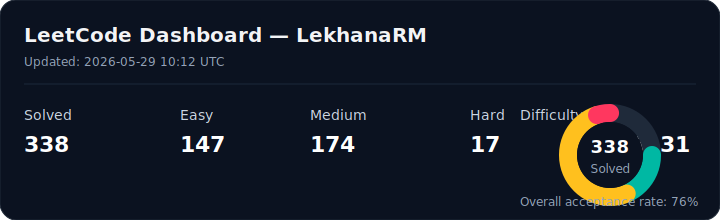

## 🐒 Monkeytype Dashboard

<!-- MONKEYTYPE:START -->
_loading..._
<!-- MONKEYTYPE:END -->

##  LeetCode Progress

  

<!-- TASKS:START -->
## 🗂️ Daily Task Dashboard

   

| Status | Task | Added | Latest comment |
|:------:|------|:-----:|----------------|
| — | _No tasks yet. Open an issue labeled `task` to add one._ | — | — |

⏳ pending · ✅ done — add a task by opening an issue labeled `task`, comment on it to add notes. Last updated 2026-07-23 08:06 UTC.
<!-- TASKS:END -->

## 🗂️ [Open my live dashboard →](https://LekhanaMitta.github.io/LekhanaMitta/)
